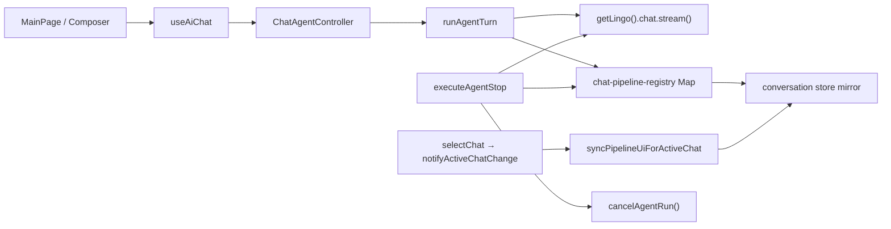

# Audit: Chat agent (LLM turn, pipeline, stop/continue)

**Pass 1:** 🟡 Surface scan  
**Pass 2:** ✅ Deep dive (2026-06-27)  
**Related:** [`docs/CHAT_AGENT.md`](../../docs/CHAT_AGENT.md), [`docs/CHAT_AGENT_STABILITY_PLAN.md`](../../docs/CHAT_AGENT_STABILITY_PLAN.md)

## Scope

- Один ход агента: submit → thinking → assistant stream → idle
- Stop, Continue, Regenerate, Edit user message
- Очередь follow-up, Agent Speech mode
- Фоновый стрим при смене чата
- Reconnect при обрыве SSE

## Key paths

| Layer | Paths |
|-------|--------|
| Model | `src/features/ai-chat/model/run-agent-turn.ts`, `useAiChat.ts`, `chat-agent-controller.ts`, `agent-chat-session.ts` |
| Lib | `chat-pipeline-registry.ts`, `stream-reconnect.ts`, `chat-agent-policies.ts`, `stop-agent-on-chat-delete.ts` |
| Stream | `src/shared/lib/openrouter-chat-stream.ts` |
| Main | `electron/main/chat-stream*.ts` (if present) |
| UI | `BackgroundStreamHint.tsx`, `AgentSettingsForm.tsx` |
| Tests | `run-agent-turn.integration.test.ts`, `chat-agent-user-actions.test.ts`, `stream-reconnect.test.ts` |

---

## Pass 2 — state machine trace

**Per-chat pipeline:** `patchChatPipeline(chatId)` in `pipeline-stage.ts` → mirrored to global `useConversationStore` only when `activeChatId === chatId` via `syncPipelineUiForActiveChat()`.

**Stream ownership:** `agent-stream-session.ts` holds global `{ streamChatId, streamActive }`; `agent-chat-session.ts` refs hold IPC `streamController` + TTS. `runAgentTurn` sets both at stream start; `endAgentTurnStreamBinding` clears on turn end.

**Run invalidation:** `agent-run.ts` generation counter; stream handlers gate on `isAgentRunActive(runId)`. Stop calls `cancelAgentRun()` → handlers no-op, partial finalize runs in `runAgentTurn` catch/post-await.

**Busy for UI:** `getAgentSessionSnapshotForView(activeChatId, stage)` → `isAgentSessionBusy` (stream active OR busy pipeline stage except `speaking`).

---

## Pass 2 — `stop({ force })` call sites

| Location | Options | Proceeds when other chat streams? | Notes |
|----------|---------|-----------------------------------|-------|
| `sendUserMessageAction` | `{ chatId }` | No (scoped) | Correct |
| `sendQueuedMessageNowAction` | `{ chatId }` | No + guard | **Fixed Pass 2** (was `{ force: true }`) |
| `beginVoiceUserMessageAction` | `{ chatId, force: !chatId }` | force only when no chat yet | Correct |
| `commitVoiceUserMessageAction` | `{ chatId: realChatId }` | No | Correct |
| `submitEditedUserMessageAction` | `{ chatId }` | No | Correct |
| `regenerateAssistantMessageAction` | `{ chatId }` | No | Correct |
| `continueAssistantMessageAction` | `{ chatId }` | No | Correct |
| `retryLastRequestAction` | `{ chatId, force: true }` | Yes (after guard) | Intentional hard reset |
| `useAiChat.forceStopAgent` | `{ force: true }` | Yes | Agent Speech session end |
| `MainPage.startVoiceCapture` (edit) | `{ chatId, force: !activeChatId }` | force only pending composer | Correct |
| `stopAgentOnChatDeleted` | `{ chatId, force: true }` | Only if deleted chat owns stream | Correct (P1-2 fixed) |
| **Chat switch** | — | — | **No stop call** — P0-1 fixed via `register-active-chat-effects.ts` |

**P0-1 (archived):** Chat navigation no longer calls `stop({ force: true })`. `register-active-chat-effects.ts` only stops TTS (except when leaving the streaming chat as active view) and calls `syncPipelineUiForActiveChat()`. Evidence: `run-agent-turn.background-stream.integration.test.ts`.

---

## Pass 2 findings

| ID | Sev | Status | Issue | Evidence |
|----|-----|--------|-------|----------|
| CA-01 | High | ✅ Fixed | Partial text on Stop — no orphan tail, `replyStatus: interrupted` | `run-agent-turn.integration.test.ts` "keeps partial tail after stop" |
| CA-02 | High | ✅ Fixed | Continue in-place via `assistantContinuationPrefix` | Electron sanitizer dropped prefix; `done` tail overwrote merged text; integration test added |
| CA-03 | High | 🟡 Verify | Reconnecting stage + max 3 retries | Loop in `run-agent-turn.ts:419–446`; unit test `stream-reconnect.test.ts`; **no integration test for reconnect loop** |
| CA-04 | Medium | Open | `replyStatus` `interrupted` / `incomplete` — no UI copy; only gates Continue | `ConversationTurn.tsx` uses `canContinueAssistantReply`; no visible label for status |
| CA-05 | Medium | ✅ Fixed | Background stream preserved on chat switch (P0-1) | `register-active-chat-effects.ts`; background-stream integration test |
| CA-06 | Medium | 🟡 Verify | Regenerate/edit tail cleanup | `findTurnTailRemoveId` + `reconcileTurnMessagesFromStore`; orphan prune in send/edit actions; manual QA A4/A5 |
| CA-07 | Low | Open | Reasoning models: thinking vs assistant under load | `chat-agent-stream-turn.ts` handles delta split; no load/stress test |
| CA-08 | Medium | ✅ Fixed | `sendQueuedMessageNowAction` used `force: true` → could abort background stream | Fixed Pass 2: scoped `{ chatId }` + `getOtherChatStreamBlocking` guard |
| CA-09 | Low | Open | Reconnect backoff `sleepMs` ignores abort — Stop during `reconnecting` may linger ≤3.2s | `run-agent-turn.ts:440`; `sleepMs` supports `AbortSignal` but not wired |
| CA-10 | Low | Open | No integration test: Continue / reconnect / rapid Stop+Send | Test gaps (see below) |

---

## Pass 1 checklist (Pass 2 verdict)

| Item | Verdict | Evidence |
|------|---------|----------|
| Read `CHAT_AGENT_MANUAL_QA.md` A–D | ⬜ Pending | Not executed in Pass 2 |
| Stop mid-stream → partial kept, Continue visible, Speak hidden while busy | 🟡 Partial | Partial+Continue: code + integration test; Speak hidden: `isAgentSessionBusy` excludes `speaking`; manual confirm |
| Agent Speech: stop clears TTS, no auto-queue mic | 🟡 Partial | `stopAgentSpeechSession` → `forceStopAgent` + voice cancel; manual B3/B5 |
| Switch chat while background stream → hint + no stuck busy | ✅ Pass | `BackgroundStreamHint`, `getBackgroundStreamChatId`, background-stream test, P0-1 fix |
| API error → idle + retry; partial not silently dropped | 🟡 Partial | `finalizePartialTurnOnStop('incomplete')` on errors; retry via banner action; manual E1 |
| Integration tests cover stop + continue paths | ✅ Pass | Stop + Continue integration tests in `run-agent-turn.integration.test.ts` |

---

## Test coverage gaps (Pass 2)

| Area | Covered | Missing |
|------|---------|---------|
| Happy-path turn | ✅ | — |
| Stop + partial keep | ✅ | — |
| Background stream on chat switch | ✅ | — |
| Scoped stop (other chat) | ✅ unit `chat-agent-stop.test.ts` | — |
| Continue turn | unit only | Integration: `runTurn({ continuation })` |
| Reconnect loop | unit only | Integration: throw retryable before first token |
| Rapid Stop + Send | — | Race regression test |
| `sendQueuedMessageNow` cross-chat | ✅ added Pass 2 | — |
| Chat switch + `executeAgentStop` not called | implicit in background test | Explicit `register-active-chat-effects` test |

**Baseline:** 77 tests in `src/features/ai-chat` (all green after CA-08 fix).

---

## Recommended fix order (open items)

1. **CA-02 / CA-03** — Manual QA on desktop + add continue/reconnect integration tests
2. **CA-04** — Optional UI hint for interrupted replies (or document as intentional minimal UX)
3. **CA-09** — Wire abort signal into reconnect `sleepMs` (small diff)
4. **CA-06 / CA-07** — Manual QA reasoning models; defer load testing
5. **CA-10** — Add rapid Stop+Send integration test when stabilizing further

---

## Pass 2 code change

- **`chat-agent-user-actions.ts`:** `sendQueuedMessageNowAction` — replace `{ force: true }` with `{ chatId }` + `getOtherChatStreamBlocking` guard (aligns with D2 / P0-1).

---

## Pass 1 findings (superseded)

See Pass 2 findings table above for current status.

## Pass 1 checklist (original)

- [ ] Read `CHAT_AGENT_MANUAL_QA.md` scenarios A–D
- [ ] Stop mid-stream → partial kept, Continue visible, Speak hidden while busy
- [ ] Agent Speech: stop clears TTS and does not auto-queue mic
- [ ] Switch chat while background stream → hint + no stuck busy on other chat
- [ ] API error → idle + retry; partial not silently dropped
- [ ] Integration tests cover stop + continue paths

## Manual QA

→ [`docs/CHAT_AGENT_MANUAL_QA.md`](../../docs/CHAT_AGENT_MANUAL_QA.md)
