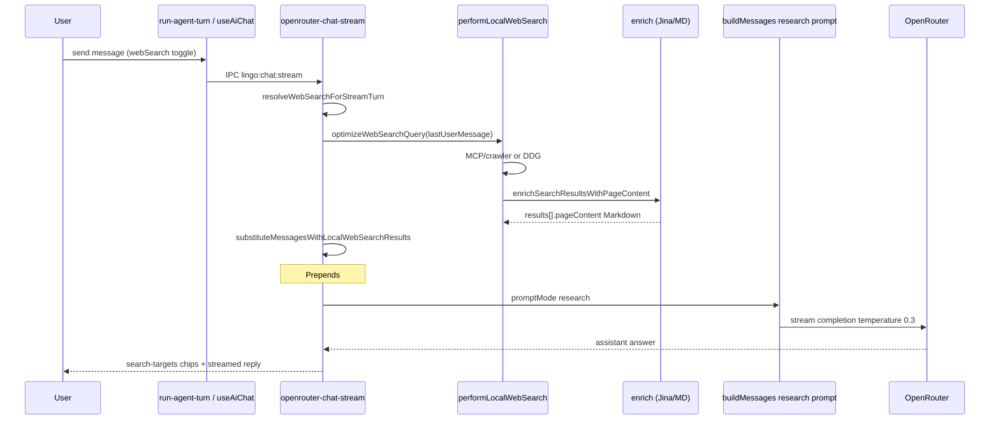

# Audit: Agent × local web search (Pass 2 — full)

**Date:** 2026-06-24  
**Scope:** How the chat agent receives search results and produces grounded answers  
**Related:** [web-search.md](./web-search.md), [`docs/CHAT_AGENT.md`](../../docs/CHAT_AGENT.md) § Web search

---

## End-to-end flow

### AI SDK path (default desktop)

When `shouldUseAiSdkStreamForRequest` and no prefetched results:

1. `completeWithLocalWebSearchViaAiSdkTool` — model may call `web_search` tool
2. Tool executes `performLocalWebSearch` → returns `formatLocalWebSearchBlock` summary
3. Same enrichment stack as legacy path

---

## Prompt contract

| Piece | Source |
|-------|--------|
| System prompt | `prompts.ts` → `research` mode when `shouldSearch` |
| User turn prefix | `formatLocalWebSearchBlock()` — `### {title}\n{markdown excerpt}` |
| Instruction | Trust excerpts over training data; cite titles not URL lists |
| UI citations | `search-targets` event → `WebSearchSources` chips |

**Critical:** LLM quality depends on **Markdown excerpts**, not bare snippets. Prior plain-text strip lost headings, tables, lists.

---

## Pipeline stages (UI)

| Stage | When |
|-------|------|
| `searching` | `send({ type: 'searching' })` at turn start |
| `search-targets` | Initial MCP/DDG hits |
| `search-visiting` | Each URL during enrichment |
| `thinking` / stream | After research block injected |
| `idle` | `done` or error |

Abort: `LocalWebSearchProgress.signal` → `LocalWebSearchError aborted`.

---

## Pass 2 findings

| ID | Sev | Status | Issue | Notes |
|----|-----|--------|-------|-------|
| A-WS-01 | Critical | ✅ Fixed | Thin DDG snippets → hallucinated answers | Markdown enrichment + research prompt |
| A-WS-02 | High | ✅ Fixed | `extractTextFromHtml` regex garbage | Readability + Turndown + Jina MD |
| A-WS-03 | High | 🟡 Verify | `requireSubstantive: true` throws «incomplete answer» on short valid replies | Tune `isSubstantiveReply` for search turns |
| A-WS-04 | High | Open | Custom LLM: local search only, no native plugin | By design; test custom endpoint QA H4 |
| A-WS-05 | Medium | Open | AI SDK tool vs prefetch duplicate search possible | Tool path skips prefetch when undefined |
| A-WS-06 | Medium | Open | `assistantContinuationPrefix` skips search | Continue mid-answer — OK |
| A-WS-07 | Medium | Open | Background stream + search on other chat | QA D1–D3 |
| A-WS-08 | Low | Open | Search block cache 16 entries, query-only key | Acceptable MVP |

---

## Code map

| Step | File | Function |
|------|------|----------|
| Turn decision | `lingo-agent/turn-policy.ts` | `resolveAgentTurnPolicy` |
| Stream gate | `web-search-turn.ts` | `resolveWebSearchForStreamTurn` |
| Search exec | `local-web-search.ts` | `performLocalWebSearch` |
| MD enrich | `local-page-research.ts` | `enrichSearchResultsWithPageContent` |
| MD extract | `html-to-markdown.ts` | `extractMarkdownFromHtml` |
| Message inject | `web-search-messages.ts` | `substituteMessagesWithLocalWebSearchResults` |
| Completion | `openrouter-chat-stream.ts` | `completeWithLocalWebSearch` |
| Tool | `lingo-agent/web-search-tool.ts` | `createWebSearchTool` |
| UI chips | `widgets/conversation-panel/ui/WebSearchSources.tsx` | targets from stream |

---

## Libraries (implemented)

| Library | Use |
|---------|-----|
| **Jina Reader** (`r.jina.ai`) | Primary fetch → JSON markdown `content` |
| **@mozilla/readability** | Article extraction from raw HTML |
| **turndown** | HTML → Markdown for LLM |
| **jsdom** | Readability in Node/Electron main |
| **websearch-mcp** | Primary search hits via crawler |

---

## Manual QA (agent + search)

| # | Scenario | Expected |
|---|----------|----------|
| AS-1 | «What is X today?» toggle ON | Answer cites source titles, facts match excerpts |
| AS-2 | Same with docker down | DDG fallback; still attempts Jina on top URLs |
| AS-3 | Stop during `search-visiting` | idle, no orphan assistant |
| AS-4 | Regenerate after search answer | New search or clean tail (no duplicate blocks) |
| AS-5 | Reasoning model + search | thinking separate; answer grounded in research block |
| AS-6 | Language practice OFF + search | research prompt, not tutor tone |

---

## Recommended next fixes

1. **A-WS-03** — relax substantive check when research block was injected and answer > N chars
2. **WS-2-03** — Settings banner if `curl localhost:3001/health` fails
3. Integration test: mock Jina JSON → assert `formatLocalWebSearchBlock` contains `###` + facts
4. Log search quality (`assessWebSearchQuality`) in dev for debugging thin turns

---

## Status

**Pass 2:** ✅ audit complete · **implementation:** markdown pipeline merged  
**Closure:** pending manual QA AS-1–AS-6 on desktop
