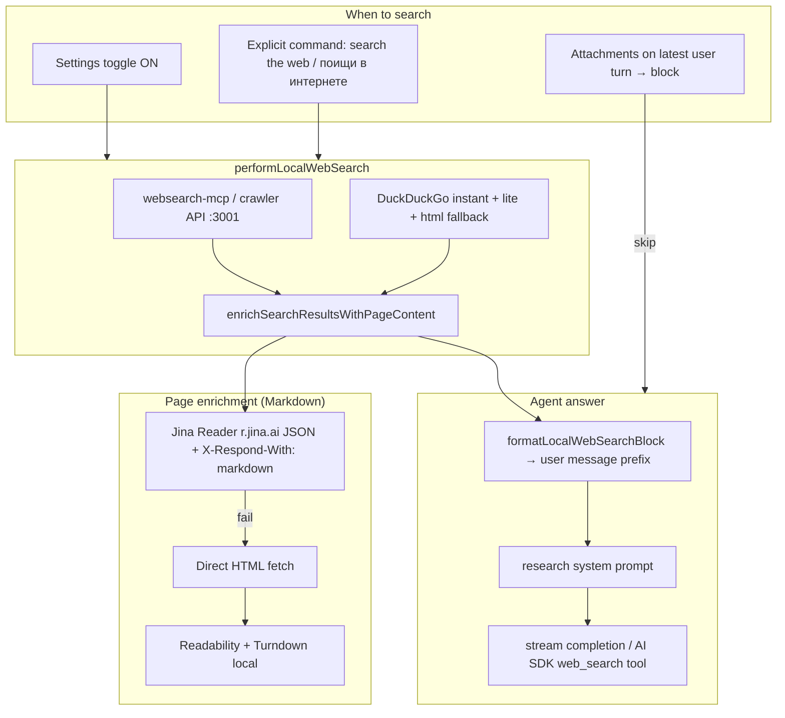

# Audit: Web search (Pass 2 — full)

**Date:** 2026-06-24  
**Pass 1:** ✅ superseded  
**Pass 2:** ✅ documented + markdown pipeline implemented  
**Related:** [local-web-search-agent.md](./local-web-search-agent.md), [`docs/CHAT_AGENT.md`](../../docs/CHAT_AGENT.md)

---

## Architecture

---

## Gate policy (2026-06-24)

| Signal | Search runs? |
|--------|----------------|
| `webSearchEnabled` + non-empty text | ✅ |
| `shouldForceWebSearch()` explicit phrase | ✅ even if toggle OFF |
| Latest user turn has attachments | ❌ |
| Keyword heuristics (weather, news, wh-questions) | **Removed** — `shouldRunWebSearchForTurn()` |

---

## Providers

| Provider | Path | Output |
|----------|------|--------|
| **WebSearch Crawler** | `websearch-mcp` → `localhost:3001/crawl` | `hit.text` plain (MCP/crawler) |
| **DuckDuckGo** | `local-web-search.ts` | title + url + snippet |
| **Jina Reader** | `local-page-research.ts` | **Markdown** JSON `content` |
| **Local extract** | `html-to-markdown.ts` | Readability article → Turndown MD |

**Dev requirement:** `docker compose -f docker-compose.websearch.yml up -d` for primary MCP path.

---

## Pass 2 findings

| ID | Sev | Status | Issue | Action |
|----|-----|--------|-------|--------|
| WS-2-01 | Critical | ✅ Fixed | Regex `html-to-text` stripped structure → poor LLM context | `html-to-markdown.ts` + Jina markdown JSON |
| WS-2-02 | High | ✅ Fixed | Keyword intent (`FACTUAL_QUERY`) caused false positives/negatives | Removed; toggle + explicit command only |
| WS-2-03 | High | 🟡 Verify | Crawler/docker not running → DDG-only thin snippets | Document in Settings; health check QA |
| WS-2-04 | High | ✅ Improved | Only 2 pages enriched, short snippets | MAX_PAGES=3, Jina-first, 4200 chars/page |
| WS-2-05 | Medium | Open | Jina rate limits / no API key in prod | Optional `LINGO_JINA_API_KEY` env (future) |
| WS-2-06 | Medium | Open | `pageContent` from crawler may still be plain text | Normalize crawler `text` → markdown pass (future) |
| WS-2-07 | Medium | Open | Cache key ignores pageContent body | `web-search-messages.ts` LRU cache — OK for same query |
| WS-2-08 | Low | Open | Settings copy vs «search every message when ON» | Update settings description |
| WS-2-09 | Low | Deferred | WS-15 vision + force-search | — |
| WS-2-10 | Low | Deferred | WS-16 substantive validation heuristics | Keep completion-quality only |
| WS-2-11 | Medium | ✅ Fixed | Search UI frozen / many inline chips | Sequential page fetch progress; collapse >3 sources behind popover; reading indicator during search |
| WS-2-12 | Medium | ✅ Fixed | Spinner static during search; sources panel minimal | `Spinner` animate-spin; sources panel with close/border/scroll; link preview on chips + panel rows |

---

## Key modules

| Module | Role |
|--------|------|
| `web-search-intent.ts` | Force-search phrases, query optimize, `shouldRunWebSearchForTurn` |
| `web-search-turn.ts` | Renderer/stream gate, attachments |
| `local-web-search.ts` | MCP → DDG → normalize → enrich |
| `local-page-research.ts` | Jina + HTML → Markdown enrichment |
| `html-to-markdown.ts` | Readability + Turndown |
| `web-search-messages.ts` | Inject research block into user message |
| `web-search-pipeline.ts` | Quality assess, dedupe, rank |
| `openrouter-chat-stream.ts` | `completeWithLocalWebSearch`, native fallback |
| `lingo-agent/web-search-tool.ts` | AI SDK tool wrapper |

---

## Manual QA (web search)

| # | Step | Expected |
|---|------|----------|
| H1 | Toggle ON, factual question | `searching` → targets → answer uses fresh facts |
| H2 | Toggle OFF, «search the web for …» | Search runs |
| H3 | Toggle OFF, casual chat | No search |
| H4 | Toggle ON, «привет» | Search runs (user chose toggle) |
| H5 | Image attachment + question | No search, vision path |
| H6 | Docker crawler up | MCP hits with `pageContent` before DDG |
| H7 | DevTools / logs | `search-visiting` URLs, markdown block in prompt |

---

## Sprint 3 (remaining)

1. Health indicator in Settings when crawler offline
2. Optional Jina API key for production rate limits
3. Pass crawler `text` through `normalizeMarkdown` / lightweight MD formatter
4. E2E test with mocked Jina JSON fixture

---

## Closure criteria

- [x] Pass 2 architecture documented
- [x] Markdown enrichment path in code
- [x] Keyword intent removed
- [ ] Manual QA H1–H7 on desktop with docker
- [ ] Settings copy aligned with toggle behavior
