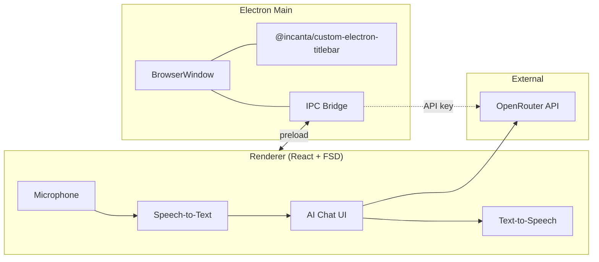

# Архитектура Lingo

## Обзор

## Процессы

| Процесс | Технологии | Роль |
|---------|------------|------|
| Main | Node, Electron | Окно, titlebar, опционально прокси API и хранение ключа |
| Preload | TypeScript | Безопасный API для renderer |
| Renderer | React, FSD | UI и пайплайн речи |

## Titlebar

Пакет: `@incanta/custom-electron-titlebar`

- Устанавливается: `npm i @incanta/custom-electron-titlebar`
- Интеграция только в **main** при создании окна
- Renderer не рисует системный title bar поверх кастомного без согласованного дизайна

## Будущая сборка (не реализовано)

Рекомендуемый scaffold:

- Vite для renderer
- Отдельный entry для `electron/main` и `electron/preload`
- Алиас `@/` → `src/`

## Стек AI и TTS

| Слой | Инструмент |
|------|------------|
| Диалог, streaming, история | Vercel AI SDK или OpenAI SDK + store |
| Сложные сценарии позже | LangGraph |
| TTS (dev) | edge-tts (main process) |
| TTS (prod) | Azure Speech |
| AI API | OpenRouter |
| Ключи | Settings + secure storage (main) |

Подробности: [STACK.md](./STACK.md), [OPENROUTER.md](./OPENROUTER.md), [API_KEYS.md](./API_KEYS.md).

## Связанные документы

- [STACK.md](./STACK.md)
- [OPENROUTER.md](./OPENROUTER.md)
- [API_KEYS.md](./API_KEYS.md)
- [FSD.md](./FSD.md)
- [SPEECH_PIPELINE.md](./SPEECH_PIPELINE.md)
- [env.example.md](./env.example.md)
