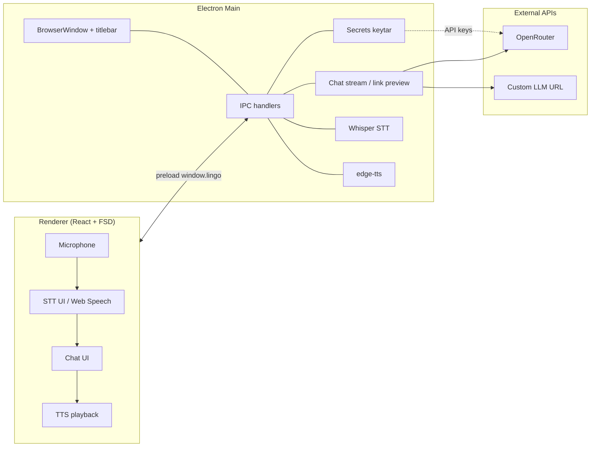

# Архитектура Lingo

## Обзор

## Процессы

| Процесс | Технологии | Роль |
|---------|------------|------|
| Main | Node, Electron | Окна, IPC, secrets, STT/TTS, прокси AI и link preview |
| Preload | TypeScript | Безопасный API `window.lingo` |
| Renderer | React, FSD | UI; на desktop AI только через IPC |

## Сборка

Реализовано на **electron-vite**:

| Target | Entry | Выход |
|--------|-------|--------|
| main | `electron/main/index.ts` | `out/main/` |
| preload | `electron/preload/index.ts` | `out/preload/` |
| renderer | `index.html`, `welcome.html`, `welcome-probe.html` | `out/renderer/` |

Web-only preview: `vite.config.ts` → `index.web.html` → `dist-web/`.

Команды: `npm run dev` (Electron), `npm run dev:web`, `npm run build`, `npm run build:web`.

## Окна и welcome

1. **Welcome probe** — лёгкая `welcome-probe.html` читает `localStorage` без загрузки полного React.
2. При необходимости — **welcome window** (`welcome.html`).
3. **Main window** — `index.html` / React; может откладывать загрузку (`deferLoad`) до конца welcome.

Second instance фокусирует существующее main-окно (`setupSingleInstanceApp`).

## Titlebar

Пакет: `@incanta/custom-electron-titlebar`

- Интеграция в **main** при создании `BrowserWindow`
- Renderer не подменяет системный title bar

## Безопасность (кратко)

| Тема | Реализация |
|------|------------|
| API keys (desktop) | keytar в main; не в renderer IPC body |
| IPC payloads | Zod в `src/shared/types/ipc-schemas.ts` |
| Исходящие URL | `outbound-url-policy.ts` (link preview, custom LLM) |
| CSP | `content-security-policy.ts` + `vite/inject-csp.ts` (dev/prod) |
| Sandbox | `sandbox: true` на BrowserWindow |

## Web preview

| Функция | Electron | Web (`dev:web`) |
|---------|----------|-----------------|
| Secrets | keytar | localStorage |
| Chat stream | main | renderer → OpenRouter |
| STT Whisper | main | ограничено |
| TTS | edge-tts main | Edge web API |
| Welcome window | да | OnboardingGate dialog |

## Стек AI и TTS

| Слой | Инструмент |
|------|------------|
| Диалог, streaming | OpenAI-compatible stream + Zustand stores |
| Сложные сценарии позже | LangGraph (не в MVP) |
| TTS (dev desktop) | edge-tts (main) |
| TTS (prod план) | Azure Speech |
| AI API | OpenRouter + optional custom base URL |

Подробности: [STACK.md](./STACK.md), [OPENROUTER.md](./OPENROUTER.md), [API_KEYS.md](./API_KEYS.md).

## Связанные документы

- [STACK.md](./STACK.md)
- [FSD.md](./FSD.md)
- [SPEECH_PIPELINE.md](./SPEECH_PIPELINE.md)
- [voice-input-architecture.md](./voice-input-architecture.md)
- [API_KEYS.md](./API_KEYS.md)
- [MVP_REVIEW.md](./MVP_REVIEW.md)
