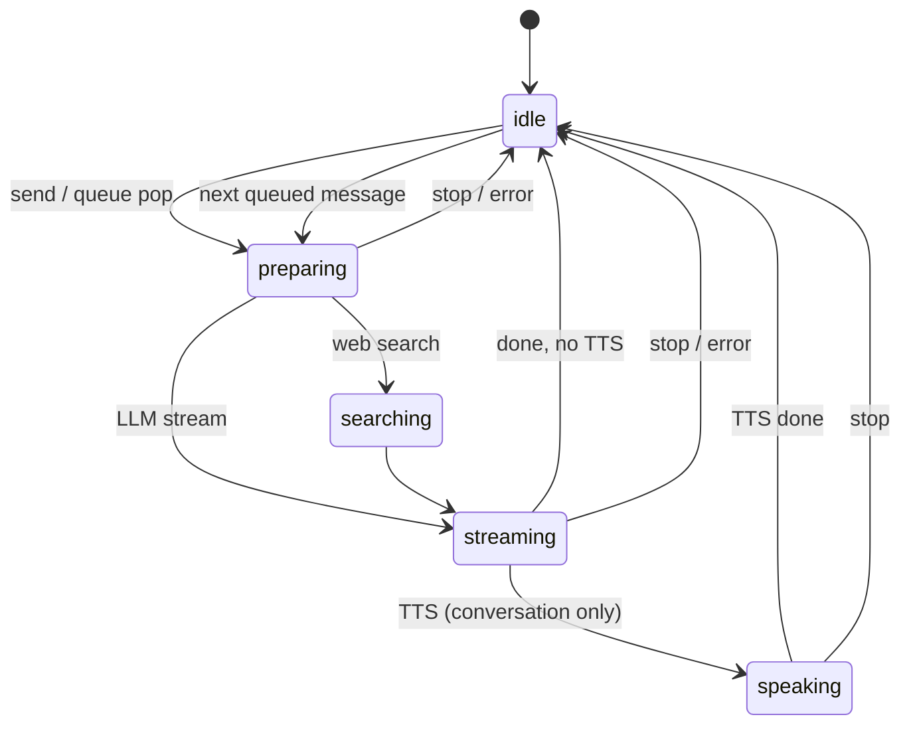

# Контракт агента чата (Lingo)

Живой контракт поведения desktop-агента. При изменении логики в `features/ai-chat` обновляйте этот файл и тесты / [CHAT_AGENT_MANUAL_QA.md](./CHAT_AGENT_MANUAL_QA.md).

План работ: [CHAT_AGENT_STABILITY_PLAN.md](./CHAT_AGENT_STABILITY_PLAN.md).

---

## Режимы композера

| Режим | `chatComposerMode` | TTS ответа |
|-------|-------------------|------------|
| Agent (текст) | `text` | **Никогда** (даже при `ttsEnabled` в настройках) |
| Agent Speech | `conversation` | Только если `ttsEnabled` |

---

## Definition of Done (кратко)

| Сценарий | Ожидаемое поведение |
|----------|---------------------|
| Отправка текста | Один ход → thinking/searching → ответ → `idle` |
| Reasoning | Сообщение `thinking` + `assistant` раздельно; TTS только по `assistant` |
| Agent Speech + TTS | Озвучка после ответа; затем `idle` или auto-listen |
| Stop (квадрат) | Abort, `idle`, TTS off, очередь и pending сброшены (`force`) |
| Очередь | Пока busy — enqueue; после хода — один dequeue; Stop — clear queue |
| Смена чата/режима | Сессия прервана, без залипшего busy |
| Regenerate / edit | Хвост хода (thinking/assistant) удалён корректно |
| Фоновый стрим | Другой чат стримит — guard, без отправки в занятый чат |
| Ошибка API | Ошибка в UI, `idle`, retry; partial ответ по правилам cleanup |

---

## Машина состояний хода (целевая)

Голосовые стадии `listening` / `transcribing` — отдельно (`voice-input`), не смешивать с ходом LLM.



Реализация сегодня: `PipelineStage` в `entities/conversation` + `chat-pipeline-registry` (`thinking`, `searching`, `speaking`, `idle`).

---

## Контракт IPC-стрима (`lingo:chat:stream`)

События (`src/shared/types/ipc.ts`), обработка в `useAiChat` / `openrouter-chat-stream.ts`:

| Событие | Поле `text` | Семантика | UI / store |
|---------|-------------|-----------|------------|
| `thinking-delta` | Кумулятивный reasoning | Дельта в `delta`, полный текст в `text` | `role: thinking`, pipeline `thinking` |
| `text-delta` | Кумулятивный ответ | Только видимый ответ ассистента | `role: assistant`, `pipelineStreamingAnswer` |
| `done` | Финальный ответ | Не затирать пустым уже накопленный stream | `flushNow` sync |
| `searching` | — | Web search начался | stage `searching` |
| `search-targets` | — | Список URL/заголовков | pipeline detail |
| `error` | message | Срыв стрима | error + `idle` |

### Правила reasoning vs answer

1. Reasoning идёт только через `thinking-delta` (main: `extractStreamReasoning`).
2. Ответ идёт только через `text-delta` / `done` (`extractAssistantText`, части `type: text`).
3. Пустой placeholder `thinking` удаляется при первом токене ответа **только если** не было `thinking-delta` (`hasThinkingStream`).
4. При `done` с пустым `text` сохраняется текст из последних `text-delta` (`resolveStreamDoneAnswer`).
5. Если есть reasoning, но нет ответа — ошибка «Model returned reasoning but no answer», ход не считается успешным.

---

## Stop (`stopAgent` / кнопка Stop)

Вызов с `force: true` (композер, Agent Speech session end):

| Действие | Модуль |
|----------|--------|
| `stream.abort()` | `ChatStreamController` |
| `cancelAgentRun()` | `agent-run.ts` |
| `setAgentStreamSession(null, false)` | `agent-stream-session.ts` |
| `stopTtsPlayback()` + cancel streaming TTS | `playTts` / `streamingSentenceTts` |
| `setPipelineStageForChat(idle)` | `pipeline-stage.ts` |
| `clearChat` + `clearPendingAgentReply` | queue + pending (все релевантные chat id) |

`agentBusy` = `isAgentSessionBusy(getAgentSessionSnapshotForView(...))` — фаза хода (`streaming` / `searching` / `speaking`) **или** активный stream-session для чата. В Agent Speech автослушание смотрит `agentPhase === 'idle'`.

---

## Очередь и pending

| Механизм | Когда |
|----------|--------|
| `message-queue` | Пользователь отправил follow-up пока агент busy |
| `pending-agent-reply` | Voice commit пока другой чат стримит |
| `flushQueuedMessages` (MainPage effect) | Когда `agentBusy` стал false и очередь не пуста |

После `stop(force)` очередь **не** должна автозапускать агента.

---

## Модули (код)

| Модуль | Путь |
|--------|------|
| Оркестрация (React) | `src/features/ai-chat/model/useAiChat.ts` |
| Ход LLM | `src/features/ai-chat/model/run-agent-turn.ts` |
| Controller | `src/features/ai-chat/model/chat-agent-controller.ts` |
| Stop (pure + execute) | `src/features/ai-chat/lib/chat-agent-stop.ts` |
| Очередь (auto-flush) | `src/features/ai-chat/lib/chat-agent-queue.ts` |
| Stream policies | `src/features/ai-chat/lib/chat-agent-policies.ts` |
| Stream turn state | `src/features/ai-chat/lib/chat-agent-stream-turn.ts` |
| Transitions (целевые) | `src/features/ai-chat/lib/chat-agent-transitions.ts` |
| Session snapshot | `src/features/ai-chat/lib/agent-session-snapshot.ts` |
| Run generation | `src/features/ai-chat/model/agent-run.ts` |
| Stream session | `src/features/ai-chat/lib/agent-stream-session.ts` |
| Pipeline | `src/features/ai-chat/lib/chat-pipeline-registry.ts` |
| SSE (main) | `src/shared/lib/openrouter-chat-stream.ts` |

---

## PR checklist

```markdown
### Agent (если затронут `features/ai-chat` или чат в `MainPage`)

- [ ] Обновлён `docs/CHAT_AGENT.md` или `CHAT_AGENT_MANUAL_QA.md`
- [ ] Vitest в `src/features/ai-chat/`
- [ ] Ручной QA (релевантные пункты)
- [ ] `npm test` зелёный
```
