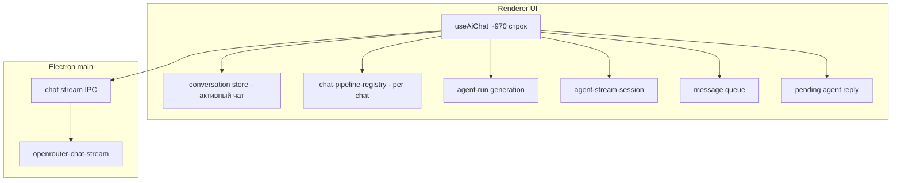
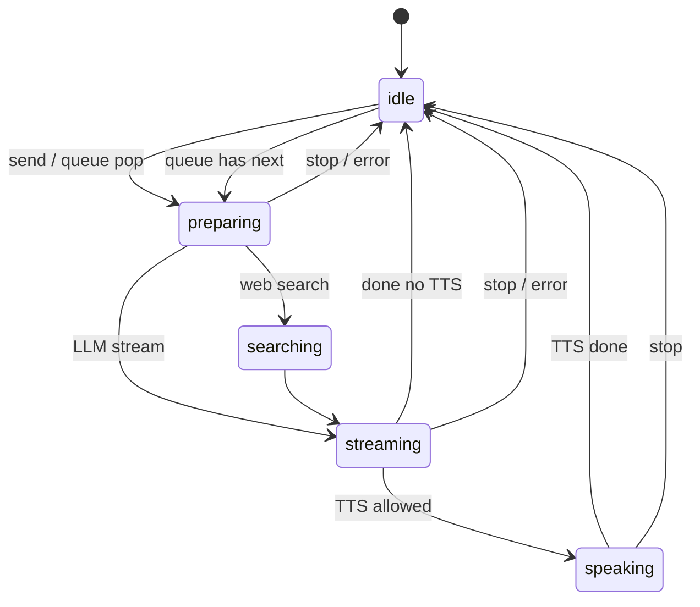

# План стабилизации агента чата (Lingo)

Цель — не «ещё один фикс в `useAiChat`», а **контракт поведения + единая машина состояний + тесты**, чтобы правки были локальными и предсказуемыми.

Связанные документы:

- [ARCHITECTURE.md](./ARCHITECTURE.md) — процессы Electron
- [SPEECH_PIPELINE.md](./SPEECH_PIPELINE.md) — STT/TTS и стадии UI
- [FSD.md](./FSD.md) — слои `features/ai-chat`
- [MVP_REVIEW.md](./MVP_REVIEW.md) — backlog MVP
- [AGENTS.md](../AGENTS.md) — контекст для AI-агентов

---

## 1. Что считать «стабильной версией»

**Definition of Done** для агента (десктоп, режимы Agent / Agent Speech):

| Сценарий | Ожидаемое поведение |
|----------|---------------------|
| Отправка текста | Один активный ход → thinking → ответ в чате → `idle` |
| Reasoning-модель | `thinking` и `assistant` раздельно; TTS только по ответу |
| Agent Speech + TTS | Озвучка **только** в `conversation`; после хода — `idle` или снова микрофон |
| Stop / квадрат в композере | Мгновенно: abort, `idle`, без TTS, **без** автозапуска очереди |
| Очередь follow-up | Пока агент занят — в очередь; после хода — один следующий; Stop очищает очередь |
| Смена чата / режима | Прерывание сессии без «залипшего» busy на другом чате |
| Regenerate / edit | Хвост хода удаляется корректно; нет дублей thinking+assistant |
| Фоновый стрим | Другой чат стримит — активный чат не ломается; guard понятен пользователю |
| Ошибка API | Сообщение в UI, `idle`, retry работает; partial-ответ не теряется без причины |

Пока этого нет в **автотестах + чеклисте релиза** — версия не «стабильная», а «работает у нас на машине».

---

## 2. Почему сейчас «чиним одно — ломаем другое»

### 2.1 Размазанное состояние (5+ источников правды)



Типичные регрессии из этого:

- `stage === idle`, но `agentBusy === true` (сессия стрима не сброшена) — уже было со Stop.
- `finishAgentTurn` не вызван, но очередь снова запускает агента — было с `flushQueuedMessages`.
- Thinking удалён при первом токене ответа, хотя reasoning уже в UI — гонка RAF/sync.
- TTS в Text-режиме — отдельный флаг в настройках vs режим композера.

### 2.2 Монолит `useAiChat.ts`

Вся логика хода: стрим, thinking, очередь, TTS, stop, voice defer, regenerate — в одном хуке. Любое изменение задевает 3–4 ветки `try/catch/finally`.

### 2.3 Нет контрактных тестов на ход агента

Есть хорошие **unit**-тесты (`pipeline-stage`, `agent-turn-cleanup`, `release-stale-agent-pipeline`), но **нет**:

- интеграции «стрим событий → сообщения в store»;
- сценариев Stop / queue / supersede run;
- e2e smoke по агенту (в `MVP_REVIEW` это прямо отмечено).

---

## 3. Целевая архитектура (куда прийти)

### 3.1 Один оркестратор хода — `ChatAgentController`

Вынести из `useAiChat` в `features/ai-chat/model/` (или `lib/`):

```
chat-agent-controller.ts   # чистая логика, без React
useAiChat.ts               # тонкая обёртка: store + callbacks + refs
```

**Controller** принимает порты (интерфейсы):

- `ChatStore` — add/update/remove messages
- `Pipeline` — setStage, setStreamingAnswer, setError
- `StreamPort` — `lingo.chat.stream` + abort
- `TtsPort` — play/cancel (только если `mode === conversation`)
- `QueuePort` — enqueue/dequeue/clear

React-хук только подписывается на снимок: `{ busy, stage, ... }` и вызывает `controller.sendUserMessage()` / `controller.stop()`.

### 3.2 Явная машина состояний

Один enum фаз хода (не смешивать с UI `listening`/`transcribing` — те остаются в voice-слое):



Правила в **одном файле** `chat-agent-transitions.ts`:

- кто может вызвать `idle` (только `stop()`, `completeTurn()`, `failTurn()`);
- при `stop(force)` — всегда: abort + clear session + clear queue + clear pending;
- при смене `runId` — `releaseStalePipeline(chatId)` без затирания чужого активного хода.

### 3.3 Слить флаги «занятости»

Сейчас: `agent-run` + `agent-stream-session` + `streamActive` (useState) + `chat-agent-busy`.

**Цель:** один `AgentSessionSnapshot` на чат:

```ts
type AgentSessionSnapshot = {
  runId: number
  chatId: string
  phase: AgentPhase  // из машины состояний
  streamActive: boolean
}
```

`isChatAgentBusy(chatId)` = одна функция от snapshot, без расхождений.

### 3.4 Контракт стрима (main ↔ renderer)

Зафиксировать в `docs/CHAT_AGENT.md` (новый файл, см. Фазу 0):

| Событие | Семантика | Куда в UI |
|---------|-----------|-----------|
| `thinking-delta` | кумулятивный reasoning | `role: thinking` |
| `text-delta` | кумулятивный ответ | `role: assistant` |
| `done` | финальный ответ; не затирать пустым | flush sync |
| `searching` / `search-targets` | web search UI | pipeline detail |

Плюс тесты на `openrouter-chat-stream.ts`: reasoning + text в одном chunk, только reasoning, только text, `done` с пустым text при непустых дельтах.

---

## 4. План по фазам

### Фаза 0 — Заморозка контракта (2–3 дня) ✅

**Без рефакторинга**, только документ и чеклист.

1. ✅ `docs/CHAT_AGENT.md` — таблица сценариев из §1 + диаграмма состояний.
2. ✅ `docs/CHAT_AGENT_MANUAL_QA.md` — 15–20 шагов (Text / Agent Speech / Stop / queue / 2 чата).
3. ✅ `MVP_REVIEW.md` — секция **Agent stability** со ссылкой на DoD.
4. ✅ Правило для PR: `.cursor/rules/ai-chat.mdc` + чеклист в `CHAT_AGENT.md`.

**Выход:** команда и агенты в Cursor знают, *что* нельзя ломать.

---

### Фаза 1 — Тесты-предохранители (1 неделя) ✅

Покрыть **текущее** поведение, чтобы рефакторинг не был вслепую.

**Сделано (2026-05-24):**

- `chat-agent-policies.ts` + test (done answer, thinking placeholder, TTS gating)
- `chat-agent-stream-turn.ts` + test (text-delta, done)
- `chat-agent-stop.ts` + test (`executeAgentStop`, force clear queue/session)
- `release-stale-agent-pipeline.test.ts` — superseded run
- `chat-agent-transitions.ts` — скелет фазы 2
- `useAiChat` делегирует stop/stream policy в lib
- `chat-agent-queue` + test (auto-flush после stop)
- `run-agent-turn.integration.test.ts` (mock stream → store; `window` stub в node env)
- `reconcile-turn-messages.ts` + test
- `chat-agent-user-actions.test.ts`, `agent-chat-session.test.ts`

### Фаза 2 — Выделение Controller (1–2 недели) 🔄

**Сделано (2026-05-24):**

- `run-agent-turn.ts` — полный ход LLM (вынесен из хука); reconcile **до** post-stream flush
- `chat-agent-controller.ts` — `runTurn`, `stop`, `processNextInQueue`, `flushQueuedMessages`
- `agent-chat-session.ts` — refs → `AgentTurnSession` / `AgentStopContext`
- `chat-agent-user-actions.ts` — send/voice/edit/regenerate/retry (без React)
- `useAiChat.ts` — обёртка (~270 строк, было ~970)

1. ✅ `runAssistantReply` → `runAgentTurn` + `ChatAgentController.runTurn()`.
2. ✅ `stopAgent` → `executeAgentStop` / `controller.stop()`.
3. ✅ `processNextInQueue` / `flushQueuedMessages` в controller.
4. 🔄 `useAiChat` < 200 строк (осталось: вынести turn-hook или queue-only surface).

**Правило:** новые фичи агента — только через controller + transition table.

**Выход:** изменения локализованы; `useAiChat` перестаёт быть «минным полем».

---

### Фаза 3 — Упрощение UI-слоя (3–5 дней) 🔄

**Сделано (2026-05-24):**

- `agent-session-snapshot.ts` + test — `runId`, `phase`, `streamActive` → `isAgentSessionBusy`
- `useAiChat` — `agentBusy` / `agentPhase` из snapshot; убран `streamActive` useState
- `useLiveConversationLoop` — `agentPhase === 'idle'` + snapshot в таймере (не дубли `agentBusy` + `stage`)
- `forceStopAgent()` в хуке; Agent Speech Stop → `forceStopAgent()`

1. ✅ `agentBusy` из `AgentSessionSnapshot`.
2. ✅ `streamActive` useState убран (сессия в `agent-stream-session`).
3. 🔄 MainPage: voice cleanup остаётся в `stopAgentSpeechSession`; LLM stop через `forceStopAgent`.
4. ✅ Agent Speech loop на `agentPhase`.

**Выход:** UI не гадает, занят ли агент.

---

### Фаза 4 — Интеграция и smoke (1 неделя)

1. **Интеграционный тест** renderer: mock `window.lingo.chat.stream` → полный ход в zustand store.
2. Восстановить/добавить **Playwright smoke** (в репо был `smoke.electron`):
   - send message → дождаться assistant → `idle`
   - Stop во время thinking → `idle` < 2s
3. CI: `npm test` + smoke на release workflow (хотя бы win).

**Выход:** регрессии ловятся до merge.

---

### Фаза 5 — Стабильный релизный канал (ongoing)

1. Версия **0.2.0-agent-stable** (или beta tag) только после зелёного QA-чеклиста.
2. Changelog секция «Agent» с каждым PR.
3. Раз в спринт — 30 мин regression по `CHAT_AGENT_MANUAL_QA.md`.
4. Запрет на новые глобальные ref-модули (`pendingReply`, `streamSession`) без записи в `CHAT_AGENT.md`.

---

## 5. Матрица: что не трогать без теста

| Область | Риск | Обязательный тест |
|---------|------|-------------------|
| `stopAgent` / Stop UI | busy, очередь | Stop clears all |
| `finally` в runTurn | TTS обрыв, stage | stop during speaking |
| `onTextDelta` + thinking | удаление thinking | reasoning then answer |
| TTS gating | озвучка в Text | mode + ttsEnabled |
| `flushQueuedMessages` effect | автоперезапуск | stop then no flush |
| Cross-chat stream | guard / busy | stream on B, view A |
| `releaseStaleAgentPipeline` | ложный idle | active run2 on same chat |

---

## 6. Что сознательно отложить (чтобы не размыть фокус)

- LangGraph / multi-tool agent — после стабильного single-turn + queue.
- Web parity (`dev:web`) — отдельный контракт; не смешивать с desktop agent tests.
- Streaming TTS по предложениям во время стрима — отдельная фича после стабильного post-turn TTS.
- Новые модели / reasoning formats — только через адаптер в `openrouter-chat-stream`, не в `useAiChat`.

---

## 7. Рекомендуемый порядок работ (кратко)

```text
Неделя 1:  Фаза 0 + P0 тесты (stop, session, queue, done/thinking)
Неделя 2:  Фаза 1 P1 + начало Фазы 2 (controller skeleton)
Неделя 3:  Фаза 2 завершение + Фаза 3
Неделя 4:  Фаза 4 smoke + QA чеклист → tag 0.2.0-agent-stable
```

Параллельно: **не добавлять** логику в `useAiChat` — только в controller или `lib/` с тестом.

---

## 8. Связь с уже сделанными фиксами

Недавние патчи (TTS только Agent Speech, `releaseStale`, Stop + session + queue) — это **временные предохранители**. Они остаются валидными, но без Фазы 1–2 следующий фикс снова может открыть старую дыру.

Имеет смысл **сразу** добавить 3–4 теста на Stop/session/queue (Фаза 1, P0) — это даст максимум стабильности за минимальное время.

---

## 9. Текущие модули агента (ориентир по коду)

| Модуль | Путь | Роль |
|--------|------|------|
| Хук чата | `src/features/ai-chat/model/useAiChat.ts` | React-обёртка controller + user actions |
| User actions | `src/features/ai-chat/model/chat-agent-user-actions.ts` | send / voice / edit / regenerate |
| Session refs | `src/features/ai-chat/model/agent-chat-session.ts` | stream + TTS refs для хода |
| Turn runner | `src/features/ai-chat/model/run-agent-turn.ts` | LLM stream → store |
| Controller | `src/features/ai-chat/model/chat-agent-controller.ts` | run / stop / queue |
| Run generation | `src/features/ai-chat/model/agent-run.ts` | `beginAgentRun` / `cancelAgentRun` |
| Stream session | `src/features/ai-chat/lib/agent-stream-session.ts` | Какой чат стримит |
| Pipeline per chat | `src/features/ai-chat/lib/chat-pipeline-registry.ts` | stage, thinking text, search |
| Pipeline UI sync | `src/features/ai-chat/lib/pipeline-stage.ts` | Зеркало в conversation store |
| Busy check | `src/features/ai-chat/lib/chat-agent-busy.ts` | `isChatAgentBusy` |
| Stale cleanup | `src/features/ai-chat/lib/release-stale-agent-pipeline.ts` | Сброс застрявших стадий |
| Turn cleanup | `src/features/ai-chat/lib/agent-turn-cleanup.ts` | thinking/assistant tail |
| Stream (main) | `src/shared/lib/openrouter-chat-stream.ts` | SSE, thinking/text deltas |
| Очередь | `src/entities/message-queue/model/store.ts` | follow-up сообщения |
| Pending reply | `src/features/ai-chat/lib/pending-agent-reply.ts` | Отложенный ход после voice |
| UI entry | `src/pages/main/ui/MainPage.tsx` | Stop, live conversation, flush queue |

---

## 10. Правило для PR (копировать в описание)

```markdown
### Agent checklist (если затронут `features/ai-chat` или `MainPage` чат)

- [ ] Обновлён сценарий в `docs/CHAT_AGENT.md` или `CHAT_AGENT_MANUAL_QA.md` (если меняется поведение)
- [ ] Добавлен/обновлён Vitest в `src/features/ai-chat/`
- [ ] Пройден ручной пункт из QA: Stop / queue / Agent Speech (релевантные)
- [ ] `npm test` зелёный
```

---

*Документ создан: 2026-05-24. Живой план стабилизации; при завершении фазы — помечать в PR ссылкой на номер фазы (например `agent-stable-phase-1`).*
